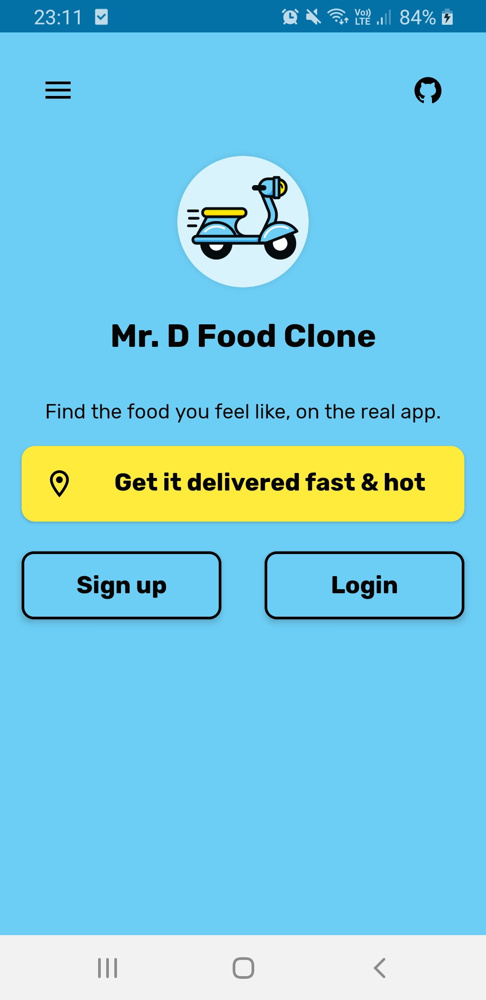
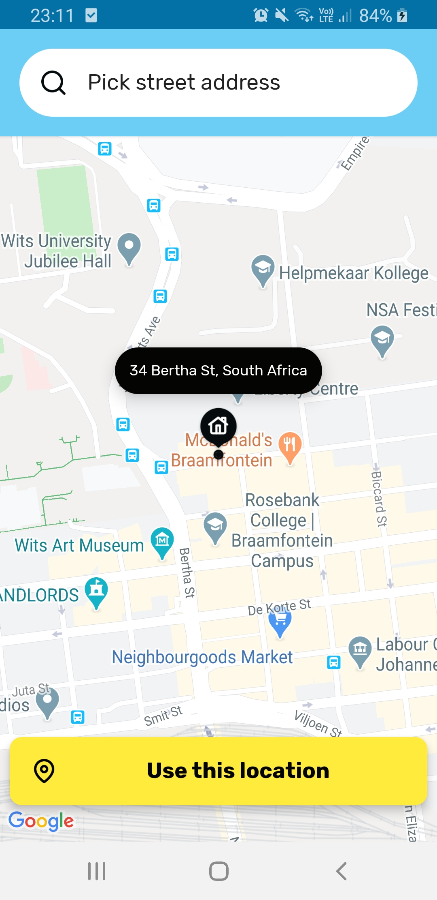
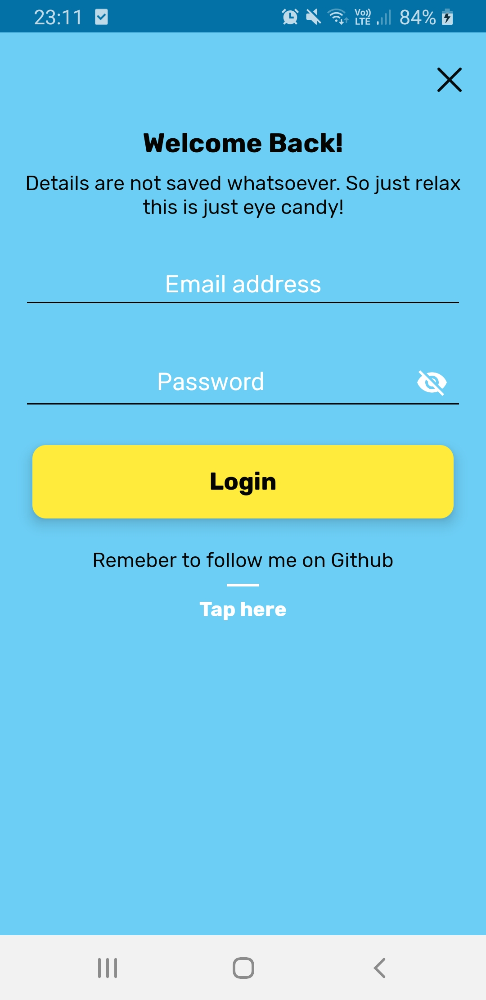
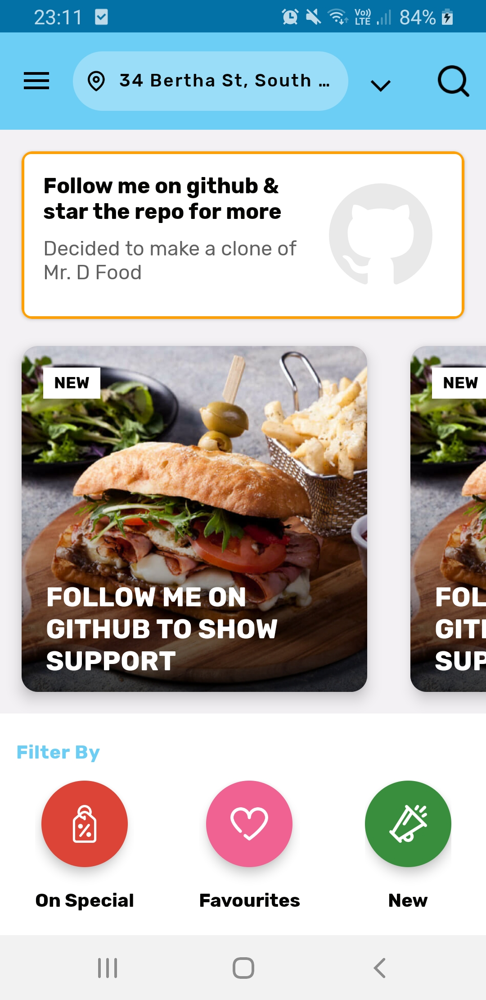

# :hamburger: Mr. D Food clone app
Decided to make a Mr. D Food clone Android app with a twist in UX/UI design. Unfortunately you can't order pizza :pizza: on this one :disappointed_relieved:

## What I learned
* Google Maps SDK for Android fundementals
* Custom UI design
* View animator usage
* Geocoder to get street address

## Screenshots

## Contributions
Feel free to contribute.
